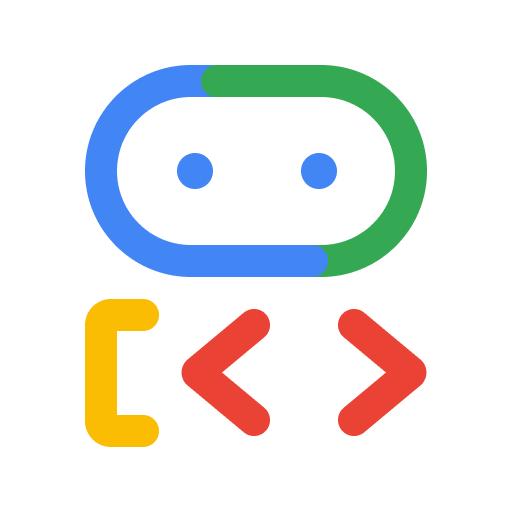

# Agent Development Kit (ADK)

[](LICENSE)

<div align="center">
  
  <h3>
    An open-source, code-first Go toolkit for building, evaluating, and deploying sophisticated AI agents with flexibility and control.
  </h3>
  <h3>
    Important Links:
    <a href="https://google.github.io/adk-docs/">Docs</a> &
    <a href="https://github.com/google/adk-samples">Samples</a>
  </h3>
</div>

The Agent Development Kit (ADK) is designed for developers seeking fine-grained control and flexibility when building advanced AI agents that are tightly integrated with services in Google Cloud. It allows you to define agent behavior, orchestration, and tool use directly in code, enabling robust debugging, versioning, and deployment anywhere – from your laptop to the cloud.

---

## ✨ Key Features

* **Code-First Development:** Define agents, tools, and orchestration logic for maximum control, testability, and versioning.
* **Multi-Agent Architecture:** Build modular and scalable applications by composing multiple specialized agents in flexible hierarchies.
* **Rich Tool Ecosystem:** Equip agents with diverse capabilities using pre-built tools, custom Go functions, API specifications, or integrating existing tools.
* **Flexible Orchestration:** Define workflows using built-in agents for predictable pipelines, or leverage LLM-driven dynamic routing for adaptive behavior.
* **Integrated Developer Experience:** Develop, test, and debug locally with a CLI and visual web UI.
* **Built-in Evaluation:** Measure agent performance by evaluating response quality and step-by-step execution trajectory.
* **Deployment Ready:** Containerize and deploy your agents anywhere – scale with Vertex AI Agent Engine, Cloud Run, or Docker.
* **Native Streaming Support:** Build real-time, interactive experiences with native support for bidirectional streaming (text and audio).
* **State, Memory & Artifacts:** Manage short-term conversational context, configure long-term memory, and handle file uploads/downloads.
* **Extensibility:** Customize agent behavior deeply with callbacks and easily integrate third-party tools and services.

## 🚀 Installation

You can install the ADK CLI using Go:

```bash
go install github.com/nvcnvn/adk-golang/cmd/adk@latest
```

Or download a pre-built binary from the [releases page](https://github.com/nvcnvn/adk-golang/releases).

## 🔑 Setup API Key

Follow this [guide](https://google.github.io/adk-docs/agents/models/) to get and setup your key.

## 🏁 Getting Started

Create your first agent (`my_agent/agent.go`):

```go
// my_agent/agent.go
package main

import (
	"github.com/nvcnvn/adk-golang/pkg/agents"
	"github.com/nvcnvn/adk-golang/pkg/tools"
)

func main() {
	// Define your agent here
	rootAgent := agents.NewAgent(
		agents.WithName("search_assistant"),
		agents.WithModel("gemini-2.0-flash-exp"), // Or your preferred Gemini model
		agents.WithInstruction("You are a helpful assistant. Answer user questions using Google Search when needed."),
		agents.WithDescription("An assistant that can search the web."),
		agents.WithTools(tools.GoogleSearch),
	)

	// Export the agent for the CLI to use
	agents.Export(rootAgent)
}
```

Run it via the CLI:

```bash
adk run my_agent
```

Or launch the Web UI:

```bash
adk web
```

For a full step-by-step guide, check out the [quickstart](https://google.github.io/adk-docs/get-started/quickstart/) or [sample agents](https://github.com/google/adk-samples).

## 📚 Resources

Explore the full documentation for detailed guides on building, evaluating, and deploying agents:

*   **[Get Started](https://google.github.io/adk-docs/get-started/)**
*   **[Browse Sample Agents](https://github.com/google/adk-samples)**
*   **[Evaluate Agents](https://google.github.io/adk-docs/evaluate/)**
*   **[Deploy Agents](https://google.github.io/adk-docs/deploy/)**
*   **[API Reference](https://google.github.io/adk-docs/api-reference/)**

## 🤝 Contributing

We welcome contributions from the community! Whether it's bug reports, feature requests, documentation improvements, or code contributions, please see our [**Contributing Guidelines**](./CONTRIBUTING.md) to get started.

## 📄 License

This project is licensed under the Apache 2.0 License - see the [LICENSE](LICENSE) file for details.

---

*Happy Agent Building!*